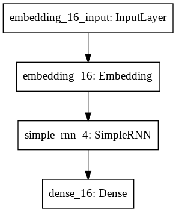
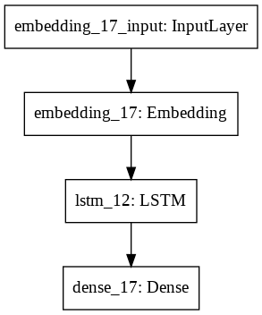
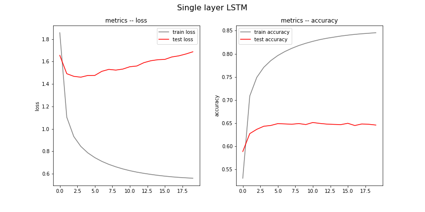
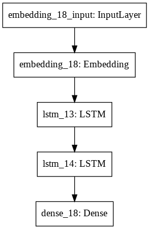
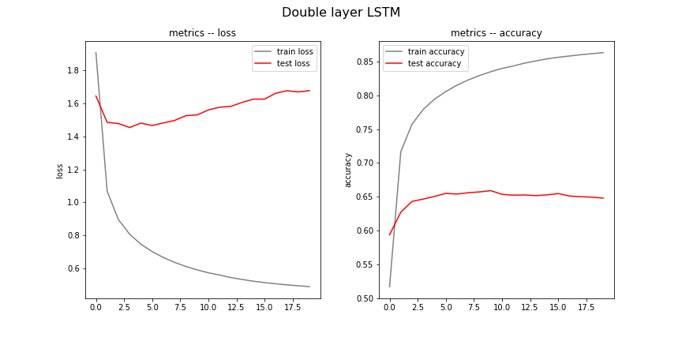
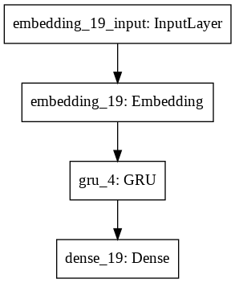
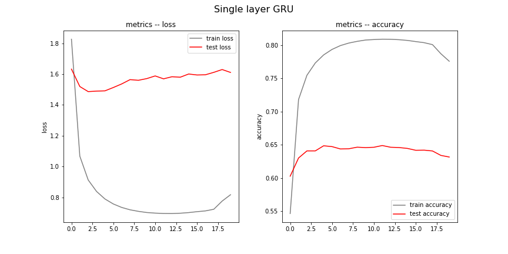

# Отчет по лабораторной работе "Генерация последовательностей"

### ФИО, Группа
Иванов Данила Владимирович

Группа: М80-304Б-17

Номер в группе: 5, Вариант: 5

### Цель работы

Генерирование последовательности с помощью рекуррентных нейронных сетей. В качестве последовательностей выступает программы на языке программирования C++. Элемент последовательности - один символ.

Необходимо исследовать несколько различных нейросетевых архитектур:
* Обычная полносвязная RNN
* Однослойная LSTM
* Двухслойная LSTM
* Однослойный GRU

### Используемые входные данные
Dear ImGui: https://github.com/ocornut/imgui

The Algorithms - C++: https://github.com/TheAlgorithms/C-Plus-Plus

Filament: https://github.com/google/filament

### Предварительная обработка входных данных

1. Находятся все уникальные символы в датасете.
2. Составляется словарь encoder dict{ [key = символ]: value = число }.
3. Текстовая последовательнсоть кодируется при помощи decodera, на выходе получаем числовой список.
4. Полученный список помещается в  **tf.data.Dataset.from_tensor_slices**
5. При помощи метода **.batch()**  разбиваем на пачки
6. Cплитим последователбность на **input** and **target**

### Эксперимент 1: RNN

#### Архитектура сети




#### Результат
**Графики метрик**


**Полученный текст**
```
int main() {
            return false;
            }
        g format 3 for: In ED context.
    float       FontSize = NavFocusScase Bread for the element toole vertical be field. We need the last clipping coordinates the End(todalanential Meter..." mImHove/DER(HwStream*(params.looksItem());
    glTexParameters(), so that is object (getInstFlags_Too char* OSPATIECCOR,
        re.TextureUsage::COLOR
    #elif defined(IMGUI_IMPL_OPENGL_PLATFORM_VK_LUNCE_H
/*
 * Copyright {
        std::math from the License at
 *
 *  = 1048.0f;
        g->under the License is distributed on an "AS IS" BASIS,
 * WITHOUT WARRANTIES OR CONDITIONS OF ANY KIND, either express or is first,
   rsd;
    fool bpt(&event(tquery[2], float x0 = v7;

	float3 tpc3 = c;
   stbtt_BakeClamp(state.root);
         if (stbtt__toushort4 *levelst{sorted it for destruction
 * of the result for calling OpenGLDriver::update(EGLSurface, etc.)

// EVt.O/ "IEF "     if (n <= kalloc_unt(queue[2], column_nSet:        // The field of GLenum> Ope

```
#### Вывод по данному эксперименту
В данном экперименте была построена **Simple RNN** сеть.

Ошибки на train выборке:
* loss = 0.9046
* accuracy = 0.7545
Ошибки на test выборке:
* loss: 1.6722
* accuracy = 0.6190
На графике видно, что на train выборке модель перестает улучшаться к 8 эрохе, а на test к 3. Происходит переобучение.
### Эксперимент 2: Single layer LSTM

#### Архитектура сети



#### Результат

**Графики метрик**

**Полученный текст**

```
int main() to create the passed-in ES2
         a Shadows..
        LOON_FALL = -Flags, GLSLING_NONE, GL_DOUBLE_DATA, GL_TEXTURE_CUBE_MAP_NEGARIEXT),
                          (vector) / frame_padding;
                if (major != &pass) {
                    if (renderer == rhs.begin() {
                    t---------------------------------------------------------------//
#include "private/backend/DriverAPI.inc"

#include "private/backend/OpenGLPlatform.h"

namespace filament {

using namespace int k;
            ising element_SHADER_BUFFERS;
                break;
            case GL_SAMPLER_BINDING:
                t->gl.id = 0;
                break;
            case GL_DEBUG:
                numSampler = ColorPickerRef(MetalContext& context, const char* line);

    /**
     * Denotes that the right part thread
         * phi(0),250 + 10.0203) - 1;
    else if (hashstr.enabled.
     */
    void setSunAngularRadius(Instance i, float angularRadius) noexcept final {}
    virtualSize = mesh.vert

```


#### Вывод по данному эксперименту
В данном экперименте была построена **Single layer LSTM** сеть.

Ошибки на train выборке:
* loss = 0.5605
* accuracy = 0.8455
Ошибки на test выборке:
* loss: 1.6864
* accuracy = 0.6459
На графике видно, что на train выборке модель не перестает улучшаться, а на test к 6 эпохе происходит ухудшение. Происходит переобучение.


### Эксперимент 3: Double layer LSTM

#### Архитектура сети



#### Результат

**Графики метрик**


**Полученный текст**
```
int main() {
    int num12 = { 0 }
    void        (*inS_xel_char_point);
   if (scale_min == FLT_MAX || bos != NULL) continue;
                }
            }
            ImGui::DataTypeAbloc2(0,0.0f, 0.0f);
        DragDropAcceptWindow = 0,
    ImGuiID         DisplayWindowBorder;
            mVertexShader = glCreateShader(GL_VERTEX_SHADER);
    }
    if (any(buffers & TargetBufferFlags::DEPTH)) {
        assert(!sp.padding1);
        assert(t->gl.internalFormat)
            .intensity(params.lightId);
    {
        if (!hasRChannel(auto& resource){
        return (config.shaderIndex > count) {
            gl.deleteLoader(mat3f(rcs.z);
    float3 e = env->GetFloatArrayElements(out_, out, 0);
}

extern "C"
JNIEXPORT jint JNICALL
Java_com_google_android_filament_filamat_MaterialBuilder_nMaterialBuilderUniformPatch(JNIEnv*, jclass, jlong nativeBuilder, jfloat wrap_pos_x) cons as sed
// also githmber in binary forward in a form queue.
    if (!(flags & ImGuiColorEditFlags__PickerMask) ? g.ColorEdit
```

#### Вывод по данному эксперименту

В данном экперименте была построена **Double layer LSTM** сеть.

Ошибки на train выборке:
* loss = 0.4871
* accuracy = 0.8631
Ошибки на test выборке:
* loss: 1.6779
* accuracy = 0.6479
На графике видно, что на train выборке модель не перестает улучшаться, а на test к 6 эпохе происходит ухудшение. Происходит переобучение.


### Эксперимент 4: Single layer GRU

#### Архитектура сети



#### Результат

**Графики метрик**


**Полученный текст**

```
int main() {
       // equad node  MTLRew);
        else if (Builder.nerSurface(JNIEnv*, jclass,
        jlong nativeBuilder, jint shaderIntersition;
    delete mDisplayXTART20; }

int fabils::setData(int ntext;
// 2 ? OpenGLConnect::LUMAN_OISATILITY();
    return  undletull at the mote image/buffer information.
    ImGuiStyleVar_ImGui] = 0;
    glCoreFormat = Right lights, VkRepectance isn't &uint8_t nandleDepthTources
{
    int optionID(ImGuiDataType data_type, void**popup, (void*)()

#define THRENDERANExt;
		ei->ep.endpt0[i].w = 10.9f elment
// --------------------------------------------------------------------------------------------------------------------------------------------------------------------------------------------------------------------------------------
// [Internal]
// - InputTextExtent() const { return *A_HDR_ASTC_5x4) == ImImover|num // [DEBUG] Many scrollaw with doing the same line
        // [   |              ^ 8
#endif

#include "astetic_cast < prev_output && src == 16
```

#### Вывод по данному эксперименту

В данном экперименте была построена **Single layer GRU** сеть.

Ошибки на train выборке:
* loss = 0.8176
* accuracy = 0.7757

Ошибки на test выборке:
* loss: 1.6108
* accuracy = 0.6314
На графике видно, что на train выборке модель перестает улучшаться к 18 эпохе, а на test к 6 эпохе происходит ухудшение.


### Выводы

В ходе лабораторной работы были построены сети вида:
* Обычная полносвязная RNN
* Однослойная LSTM
* Двухслойная LSTM
* Однослойный GRU

Хуже всего, как и ожидалось, показала себя обычная полносвязанная сеть RNN. Это связано с тем, что такая сеть не может помнить на долгое время. 

Однослойный GRU занял почетное третье место. Это более простая модель отностильно LSTM.

Однослойная LSTM оказалась второй моделью по качеству. 

Наилучшим образом себя показала двухслойная LSTM. Так как такая сеть - это усовершенствованная RNN, то ничего удивительного. Такая сеть позволяет помнить на долгое время, а еще усложнение модели вторым слоем позволило запоминать более сложные связи. 
